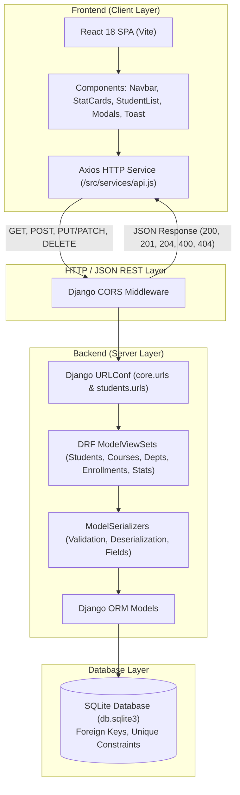
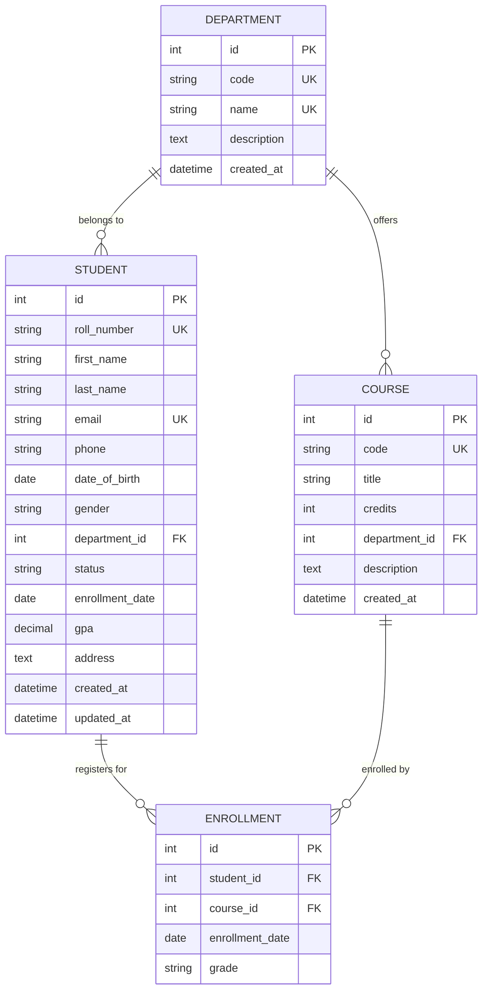

# Comprehensive Project Report: Student Management System (EduTrack)
### Standard Operating Procedure (SOP) Compliant Full-Stack CRUD Application

**Project Name:** EduTrack - Student Management System  
**Repository:** [https://github.com/Muthusamy20/Student-management-system](https://github.com/Muthusamy20/Student-management-system)  
**Technology Stack:** React (Vite), Django REST Framework, SQLite, HTML5, CSS3, JavaScript (ES6+)  

---

## 1. Project Overview & Problem Statement

### 1.1 Overview
EduTrack is a full-stack academic administration platform designed to manage students, academic departments, courses, and enrollment records. Built in accordance with the **Standard Operating Procedure (SOP) for Complete CRUD-Based Web Application Development**, it incorporates client-side state handling, server-side business logic, relational database constraints, and RESTful API design.

### 1.2 Problem Statement
Educational institutions often struggle with fragmented student records, manual course enrollment reconciliation, lack of instant search/filtering, and inconsistent data validation across departments. EduTrack solves these challenges by providing:
- A centralized relational database maintaining integrity through foreign key constraints and uniqueness validation.
- Responsive, accessible user interfaces with immediate client-side error feedback.
- Robust RESTful APIs with automated validation, error handling, and cross-origin resource sharing (CORS).

### 1.3 Objectives
- Implement all four **CRUD (Create, Read, Update, Delete)** operations across four distinct relational entities: Students, Courses, Departments, and Enrollments.
- Enforce strict **dual-layer validation** (client-side interactive feedback and server-side data integrity).
- Provide responsive filtering, real-time debounced search, and metric computation.
- Establish an automated testing pipeline verifying data integrity, error states, and API status codes.

---

## 2. Technology Stack & Justification

| Layer | Technology | Version | Justification |
|---|---|---|---|
| **Frontend UI** | React with Vite | 18+ / Vite 6+ | Component-based, rapid Hot Module Replacement (HMR), minimal bundle footprint |
| **Icons & Styling** | Lucide React, Modern CSS3 | Modern Baseline | Accessible UI, responsive grid/flexbox, native color variables, zero heavy CSS overhead |
| **HTTP Client** | Axios | 1.8+ | Promise-based HTTP client with interceptors, clean error serialization |
| **Backend Engine** | Python & Django | 3.14 / Django 6.1+ | Battery-included, robust security defaults, ORM migration engine |
| **REST API** | Django REST Framework (DRF) | 3.18+ | Declarative serializers, ModelViewSets, search & ordering filters, automated HTTP status codes |
| **Database** | SQLite3 | 3.x | Zero-configuration ACID-compliant relational persistence, ideal for demonstration and labs |
| **Version Control**| Git & GitHub | Git 2.54+ | Structured branch management, clean commit history |

---

## 3. System Architecture



---

## 4. Entity-Relationship (ER) Diagram



---

## 5. REST API Endpoint Documentation

Base API URL: `http://127.0.0.1:8000/api`

| Resource | HTTP Method | Endpoint | Request Body | Response Codes | Description |
|---|---|---|---|---|---|
| **Overview** | `GET` | `/` | None | `200 OK` | API welcome & catalog overview |
| **Students** | `GET` | `/api/students/` | None (`?search=`, `?department=`, `?status=`) | `200 OK` | List students with search and filter |
| **Students** | `POST` | `/api/students/` | JSON Student Object | `201 Created`, `400 Bad Request` | Create student with validation |
| **Students** | `GET` | `/api/students/{id}/` | None | `200 OK`, `404 Not Found` | Retrieve student & enrolled courses |
| **Students** | `PUT` | `/api/students/{id}/` | Full Student JSON | `200 OK`, `400 Bad Request` | Complete student update |
| **Students** | `PATCH` | `/api/students/{id}/` | Partial Student JSON | `200 OK`, `400 Bad Request` | Partial update (e.g. status, GPA) |
| **Students** | `DELETE`| `/api/students/{id}/` | None | `204 No Content`, `404 Not Found` | Remove student record |
| **Courses** | `GET` | `/api/courses/` | None (`?department=`) | `200 OK` | List all academic courses |
| **Courses** | `POST` | `/api/courses/` | JSON Course Object | `201 Created`, `400 Bad Request` | Add course (credits: 1-6) |
| **Courses** | `PUT/DEL`| `/api/courses/{id}/` | Course Object / None | `200 OK`, `204 No Content` | Update or remove course |
| **Departments** | `GET/POST`| `/api/departments/` | JSON Department Object | `200 OK`, `201 Created` | List or create departments |
| **Departments** | `DELETE`| `/api/departments/{id}/`| None | `204 No Content` | Delete department |
| **Enrollments** | `GET` | `/api/enrollments/` | Query (`?student=`, `?course=`) | `200 OK` | List enrollment records |
| **Enrollments** | `POST` | `/api/enrollments/` | `{ student, course, grade }` | `201 Created`, `400 Bad Request` | Enroll student (unique constraint) |
| **Enrollments** | `DELETE`| `/api/enrollments/{id}/`| None | `204 No Content` | Drop / unenroll course |
| **Dashboard** | `GET` | `/api/stats/` | None | `200 OK` | Aggregate statistics & metrics |

---

## 6. CRUD Implementation & Validation Summary

### 6.1 Validation Rules
1. **Mandatory Fields**: Roll number, first name, last name, and email cannot be blank.
2. **Email Format**: Must conform to standard RFC email specification (`user@domain.tld`).
3. **Roll Number Uniqueness**: Enforced via Django model `unique=True` and custom serializer validation excluding the current instance on updates.
4. **Phone Validation**: Cleans symbols and validates minimum 7 numeric digits.
5. **Credit Bounds**: Course credits strictly constrained between 1 and 6.
6. **Unique Enrollment**: `UniqueConstraint(fields=['student', 'course'])` prevents registering the same course twice.

---

## 7. Testing Strategy & Execution Results

### 7.1 Automated Backend Test Suite
The backend contains 10 automated unit and integration tests executing against an in-memory test database.

```text
Creating test database for alias 'default'...
..........
----------------------------------------------------------------------
Ran 10 tests in 0.127s

OK
Destroying test database for alias 'default'...
```

#### Test Matrix:
1. `test_create_student_success`: Asserts HTTP 201 Created and database record persistence.
2. `test_create_student_duplicate_roll_number`: Asserts HTTP 400 Bad Request when roll number exists.
3. `test_create_student_duplicate_email`: Asserts HTTP 400 Bad Request when email exists.
4. `test_read_student_list`: Asserts HTTP 200 OK and non-empty result array.
5. `test_read_single_student`: Asserts HTTP 200 OK and matching serialized attributes.
6. `test_update_student`: Asserts HTTP 200 OK upon PATCH and verifies database mutation.
7. `test_delete_student`: Asserts HTTP 204 No Content and record deletion from database.
8. `test_course_validation_credits`: Asserts HTTP 400 when credit exceeds 6.
9. `test_enrollment_creation_and_duplicate_prevention`: Asserts HTTP 201 for first enrollment and HTTP 400 for duplicate.
10. `test_dashboard_stats_api`: Asserts HTTP 200 OK and valid numerical metrics.

---

## 8. Installation & Setup Guide

### 8.1 Prerequisites
- Python 3.10+ (Tested on Python 3.14)
- Node.js 18+ (Tested on Node.js v24)
- Git

### 8.2 Backend Setup
```bash
# 1. Navigate to backend
cd backend

# 2. Activate virtual environment
# On Windows PowerShell:
.\venv\Scripts\Activate.ps1
# On Linux / macOS:
# source venv/bin/activate

# 3. Install dependencies
pip install -r requirements.txt

# 4. Apply database migrations
python manage.py migrate

# 5. Seed initial realistic test data
python manage.py seed_data

# 6. Run automated test suite
python manage.py test students

# 7. Start Django development server
python manage.py runserver 8000
```
*Backend API is now accessible at `http://127.0.0.1:8000/api/`*

### 8.3 Frontend Setup
```bash
# 1. Open a new terminal and navigate to frontend
cd frontend

# 2. Install NPM dependencies
npm install

# 3. Build for production (verifies build integrity)
npm run build

# 4. Start local Vite development server
npm run dev
```
*Frontend Application is now running at `http://localhost:5173/`*

---

## 9. Viva Voce & Demonstration Q&A Guide

**Q1: How do you handle CORS when frontend and backend run on different ports?**  
*Answer:* We use the `django-cors-headers` middleware placed before Django's `CommonMiddleware`. It automatically adds the appropriate `Access-Control-Allow-Origin` HTTP headers, permitting `http://localhost:5173` to make cross-origin requests.

**Q2: How is data consistency maintained when deleting a student with enrollments?**  
*Answer:* In `models.py`, the `Enrollment` model specifies `on_delete=models.CASCADE` on the student foreign key. When a student is deleted, all their related enrollment records are automatically purged, preventing orphan records.

**Q3: How do you prevent duplicate course enrollments?**  
*Answer:* At the database level, we declare a `UniqueConstraint(fields=['student', 'course'])`. At the API serializer level, we validate if a record already exists before persisting and return an informative `400 Bad Request`.

**Q4: Why implement dual-layer validation?**  
*Answer:* Client-side validation improves user experience by providing immediate feedback without waiting for a network round-trip. Server-side validation is mandatory for security, as client-side checks can be bypassed using tools like Postman or curl.
