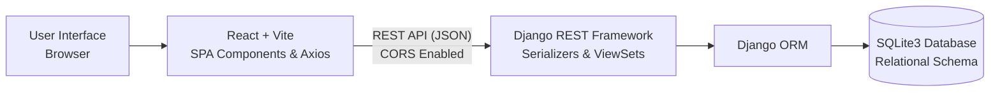

# EduTrack: Full-Stack Student Management System

[-blue?logo=react)](https://react.dev/)
[](https://www.djangoproject.com/)
[](https://www.sqlite.org/)
[](#)

A production-grade, complete CRUD (Create, Read, Update, Delete) web application developed in accordance with the **Standard Operating Procedure (SOP) for Full-Stack Web Application Development**.

---

## Key Features

- **Complete CRUD Operations**: Full lifecycle management for **Students**, **Courses**, **Departments**, and **Course Enrollments**.
- **Interactive Dashboard**: Real-time metric cards displaying total students, active enrollments, course offerings, and GPA averages.
- **Search & Filtering**: Instant search across names, roll numbers, emails, and phone numbers with multi-parameter department and status dropdown filters.
- **Dual-Layer Validation**:
  - *Client-side*: Real-time form validation with inline warnings for required fields, email format, phone numbers, and GPA bounds.
  - *Server-side*: Robust Django REST Framework ModelSerializers enforcing uniqueness, foreign key validity, and numeric ranges.
- **Safe Operations**: Confirmation dialogs for destructive actions (preventing accidental record loss).
- **Responsive UI**: Accessible design built with modern CSS3 variables, glassmorphism backdrops, Lucide icons, and mobile adaptivity.
- **Automated Testing**: Comprehensive unit test suite with 10 passing tests verifying all CRUD operations and error handling.
- **Sample Data Included**: One-command data seeder (`seed_data`) populating realistic academic data.

---

## System Architecture



---

## Quickstart Guide

### 1. Clone the Repository
```bash
git clone https://github.com/Muthusamy20/Student-management-system.git
cd Student-management-system
```

### 2. Backend Setup (Django REST Framework)
```bash
cd backend

# Create & activate virtual environment
python -m venv venv
# On Windows:
.\venv\Scripts\activate
# On Linux/macOS:
# source venv/bin/activate

# Install dependencies
pip install -r requirements.txt

# Run migrations & seed data
python manage.py migrate
python manage.py seed_data

# Run tests to verify
python manage.py test students

# Start Django server
python manage.py runserver 8000
```
*The backend API will be live at `http://127.0.0.1:8000/api/`*

### 3. Frontend Setup (React + Vite)
In a separate terminal window:
```bash
cd frontend

# Install packages
npm install

# Run the frontend dev server
npm run dev
```
*Open `http://localhost:5173` in your browser to use the application.*

---

## REST API Summary

| Method | Endpoint | Description |
|---|---|---|
| `GET` | `/api/students/` | List students (supports `?search=`, `?department=`, `?status=`) |
| `POST` | `/api/students/` | Create a new student record |
| `GET` | `/api/students/{id}/` | Retrieve details & enrollments of a student |
| `PUT` | `/api/students/{id}/` | Update full student record |
| `PATCH` | `/api/students/{id}/` | Partial update student fields |
| `DELETE`| `/api/students/{id}/` | Remove student record |
| `GET` | `/api/courses/` | List all courses |
| `POST` | `/api/courses/` | Create course (credits 1-6) |
| `GET` | `/api/departments/` | List all academic departments |
| `POST` | `/api/enrollments/` | Enroll student in a course |
| `GET` | `/api/stats/` | Dashboard metrics & aggregations |

---

## Detailed Academic Documentation
For the full academic report, architecture analysis, ER diagrams, test evidence, evaluation rubric alignment, and viva voce cheat sheet, please refer to [**DOCUMENTATION.md**](./DOCUMENTATION.md).
